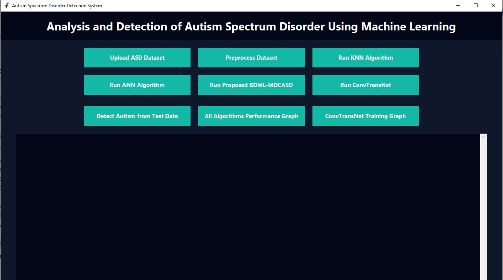
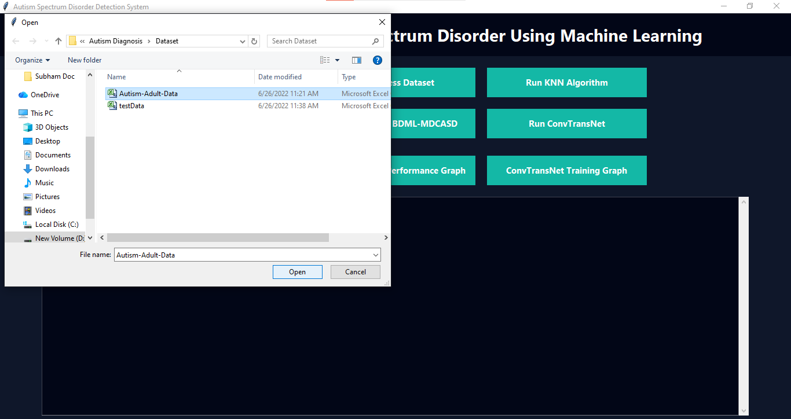
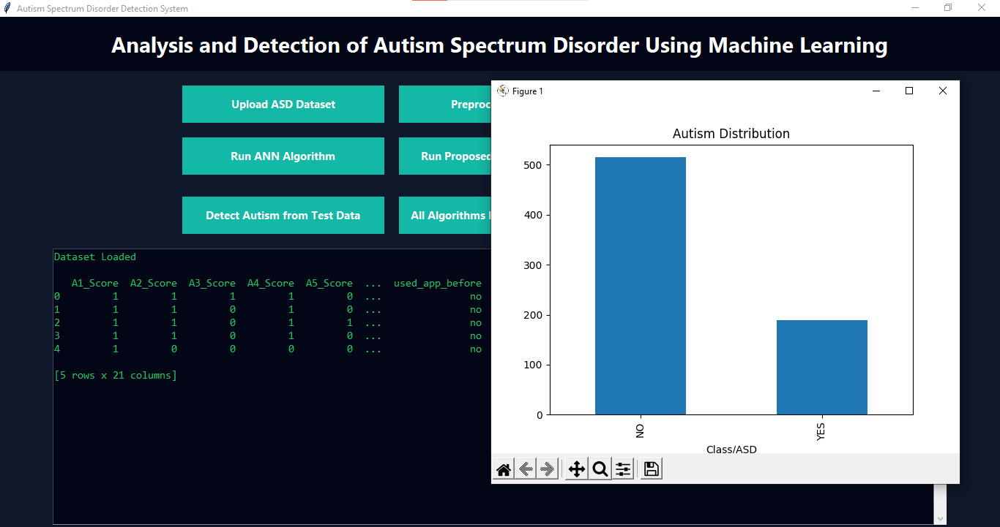
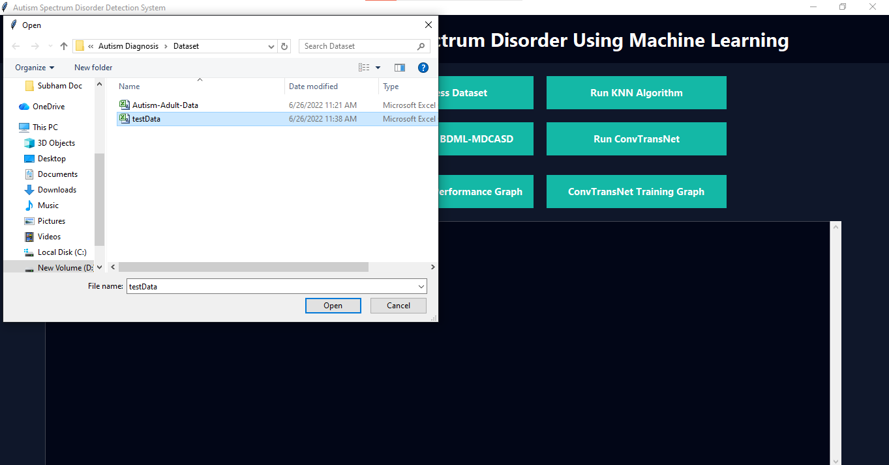
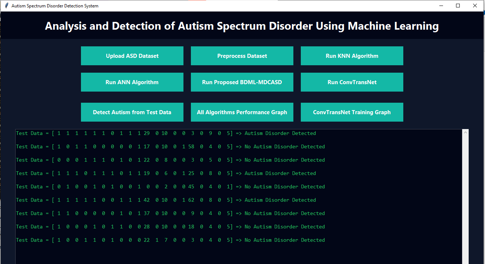
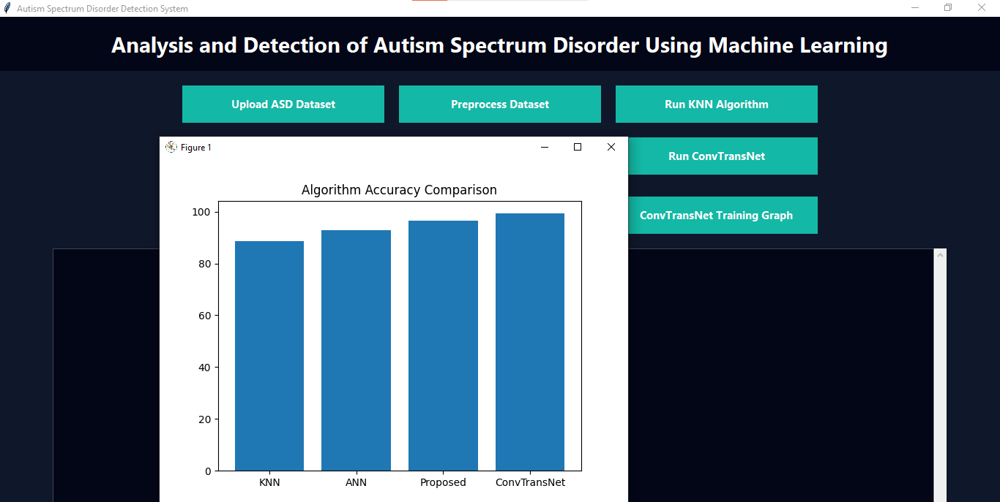
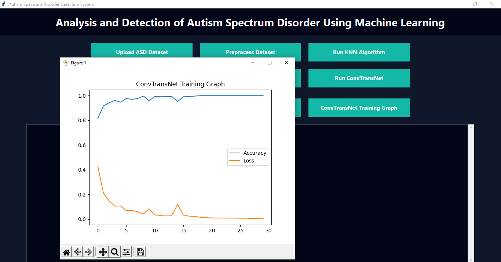

# 🧠 Autism Detection System (Machine Learning + Deep Learning)

## 📌 Description
A GUI-based Autism Detection System developed using Python and Machine Learning techniques.  
It predicts Autism Spectrum Disorder (ASD) using multiple algorithms and provides performance comparison with visualization.

---

## 🚀 Features
- Upload ASD Dataset
- Data Preprocessing (handling missing values & encoding)
- Run KNN Algorithm
- Run ANN Algorithm
- Run Proposed BDML-MDCASD Model
- Run ConvTransNet (Deep Learning Model)
- View Accuracy, Precision, Recall, F1 Score
- Display Confusion Matrix & Graphs
- Detect Autism from new test data

---

## 🛠️ Technologies Used
- Python 3.7.0
- Tkinter (GUI)
- Scikit-learn
- Keras
- TensorFlow
- Pandas
- NumPy
- Matplotlib
- Seaborn

---

---

## 📊 Algorithms Used
- KNN (K-Nearest Neighbor)
- ANN (Artificial Neural Network)
- BDML-MDCASD (Hybrid Model)
- ConvTransNet (Deep Learning Model)

---

## 📊 Dataset
- Autism dataset (CSV format)
- 704 records
- 21 features
- Output: YES / NO

---

## 📈 Results
- KNN → ~88%
- ANN → ~92%
- BDML-MDCASD → ~93%
- ConvTransNet → ~100%

---

## 📸 Screenshots

### 📂 Upload Dataset

### ⚙️ Preprocess Data

### 📊 Results Output

### 📈 Graph Output

### Test data

### All Algorthims Performed graph

### ConvTransNet Training graph

---

## ⚠️ Important Note
This project is developed using **Python 3.7.0**.  
Using higher versions (3.10+) may cause compatibility issues with TensorFlow and Keras.

---

## 👨‍💻 Author
**Haresh**
